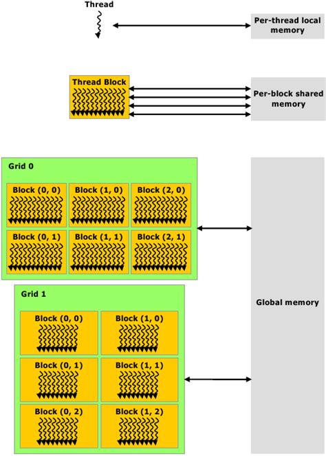
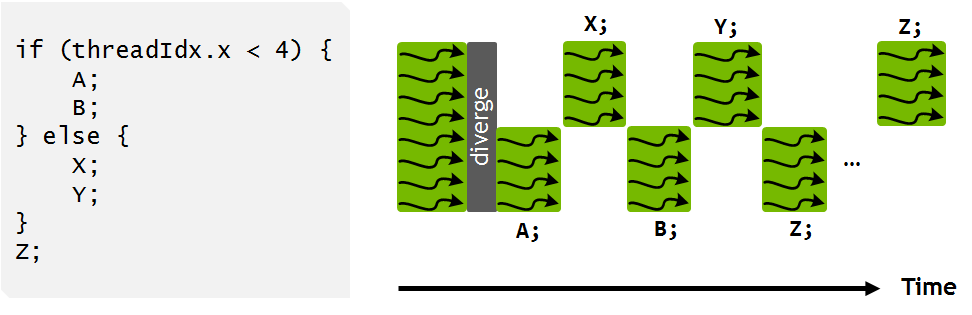
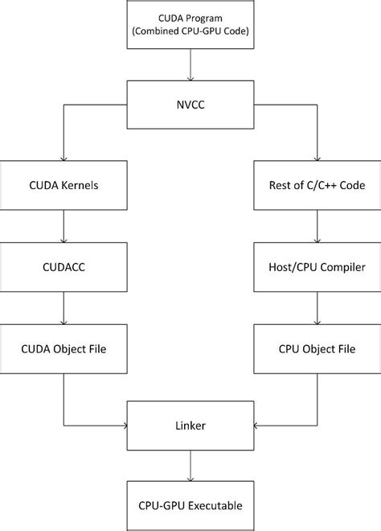
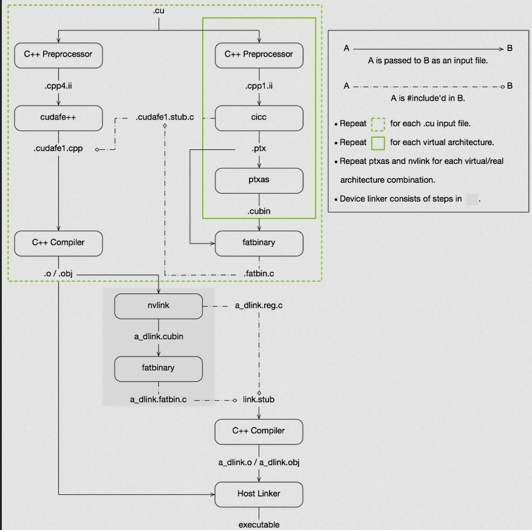

# Graphics Processing Unit (GPU) Architecture

## **Overview**

- GPUs (Graphics Processing Units) are specialized hardware designed for parallel processing.
- Their architecture is optimized for tasks involving massive data parallelism, such as graphics rendering, simulations, and AI computations.
- A GPU consists of several **Streaming Multiprocessors (SMs)**, each containing hundreds of smaller processing cores.

## **Key Components**

### **1. Streaming Multiprocessors (SMs)**

- Each SM contains:
  - **CUDA cores** for integer and floating-point operations.
  - **Special Function Units (SFUs)** for transcendental operations (e.g., sin, cos).
  - **Tensor cores** for mixed-precision matrix operations (in modern GPUs).
- SMs execute threads grouped into **warps** (32 threads).

---

### **2. Memory Hierarchy**

 In GPU architecture, the memory hierarchy is organized as follows:

    -**Registers**: Fastest storage within each core for thread-specific data.
    - **Shared Memory / L1 Cache**: Low-latency memory shared among threads within a Streaming Multiprocessor (SM).
    - **L2 Cache**: Larger cache shared across multiple SMs to reduce global memory access.
    - **Global Memory (VRAM)**: Main memory with higher latency, accessible by all SMs.

---

### **3. Thread Hierarchy**

  
  

In CUDA programming, the execution model is structured hierarchically to efficiently map computations onto the GPU's architecture. This hierarchy consists of grids, blocks, and threads, which correspond to the hardware components of the GPU.

- Grids and Blocks:

  - Threads: The smallest unit of execution, each performing a sequence of instructions.
  - Blocks: Groups of threads that execute the same kernel function and can cooperate among themselves through shared memory and synchronization. Each block is assigned to a single Streaming Multiprocessor (SM) and does not migrate between SMs during execution.
  - Grids: Collections of blocks that execute a kernel function. All blocks within a grid are independent and can execute in any order, concurrently or sequentially. This independence allows for scalability across different GPU architectures.
- Storage and Execution:

  - Threads: Each thread has access to its own set of registers and local memory.
  - Blocks: Threads within a block share access to shared memory, which resides on the SM to which the block is assigned. This shared memory enables efficient data exchange and synchronization among threads in the same block.
  - Grids: Blocks within a grid do not share memory directly; they communicate through global memory if necessary. Global memory is accessible by all threads but has higher latency compared to shared memory.
- Streaming Multiprocessors (SMs):

  - Execution: Each SM executes multiple blocks concurrently, depending on the available resources such as registers and shared memory. Within an SM, threads are organized into warps (typically 32 threads) that execute instructions in a Single Instruction, Multiple Thread (SIMT) fashion.
  - Resources: An SM contains multiple CUDA cores (also known as streaming processors), special function units for complex mathematical operations, and load/store units for memory operations. The SM's scheduler manages the execution of warps, aiming to maximize resource utilization and hide memory latencies.

Understanding this hierarchy and the role of SMs is crucial for optimizing CUDA applications, as it influences memory access patterns, synchronization strategies, and overall performance.

---

### **4. Warp Scheduling**

- Threads execute in groups of 32 (a **warp**).
- If threads in a warp diverge (e.g., due to different conditional branches), execution slows due to serial processing of divergent paths.

---

### **5. Memory Access Patterns**

- **Coalesced memory access** improves performance by aligning memory requests across threads.
- **Bank conflicts** in shared memory access can degrade performance.

---

## **Performance Characteristics**

- **High throughput over low latency**: GPUs handle many threads simultaneously but take longer to respond to individual requests.
- Efficiency depends on:

  - Thread utilization.
  - Minimizing memory latency.
  - Avoiding warp divergence.

## **CUDA Compilation**

    
    
  

  The CUDA compilation process transforms CUDA source code into an executable that runs on both the host (CPU) and device (GPU). Here's an overview of the compilation flow:

1. **Source Code Separation:**
   * CUDA source files (`.cu`) contain both host (CPU) and device (GPU) code.
   * The CUDA compiler driver, `nvcc`, separates these components for appropriate processing.
2. **Host Code Compilation:**
   * The host code, written in standard C/C++, is compiled using a host compiler (e.g., `gcc` on Linux or `cl.exe` on Windows).
   * This results in object files containing the compiled host code.
3. **Device Code Compilation:**
   * Device code, marked by CUDA-specific keywords (e.g., `__global__`, `__device__`), is compiled by `nvcc` into PTX (Parallel Thread Execution) intermediate representation.
   * PTX code is then assembled into binary code (cubin) suitable for the target GPU architecture.
4. **Fat Binary Creation:**
   * The compiled device code is embedded into the host object files as a "fat binary," which may contain multiple versions of the device code to support different GPU architectures.
5. **Linking:**
   * The host object files, now containing both host and device code, are linked together with necessary CUDA runtime libraries to produce the final executable.
6. **Runtime Execution:**
   * At runtime, the CUDA driver extracts the appropriate device code from the fat binary and loads it onto the GPU for execution.

Understanding this flow is crucial for optimizing CUDA applications and ensuring compatibility across different GPU architectures.
